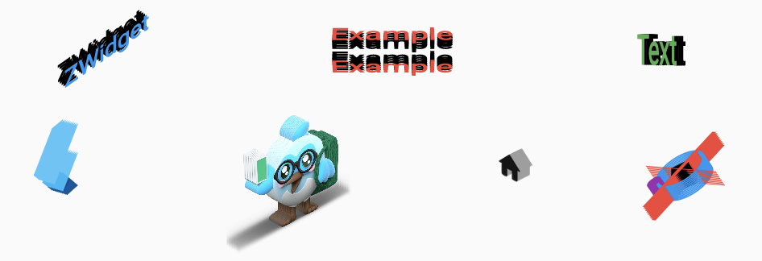
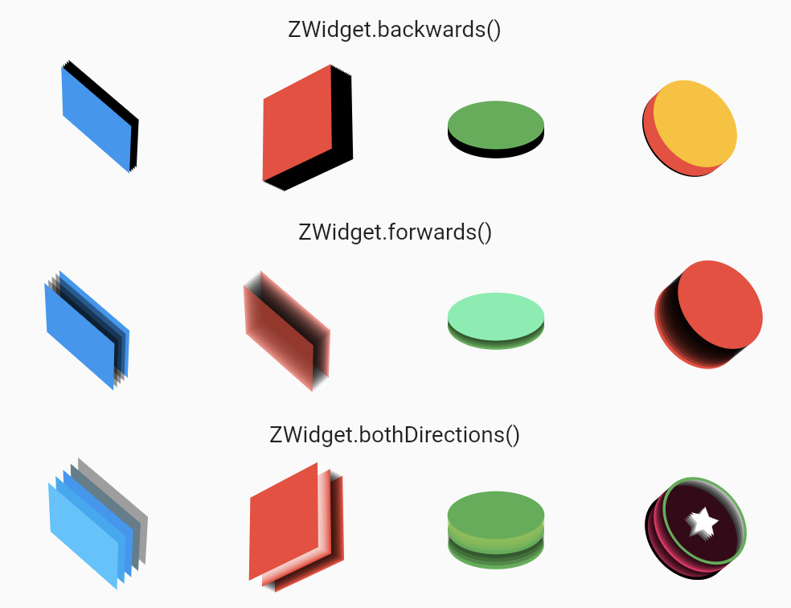

ZWidget creates a 3D-like visual by stacking widgets one above the other and transforming them adequately.

This package is heavily inspired by [ztext.js](https://bennettfeely.com/ztext/).

Since Text is a Widget, and since everything is a Widget in Flutter, apply your 3D effect to any element of your UI!

It was created for the [Flutter Puzzle Hack](https://flutter.dev/events/puzzle-hack).

## Features

Tilt your widgets and simulate 3D easily.
Here are a few examples with `Text`, `FlutterLogo`, `Ìmage`, `Icon` and `CustomPaint`:



You can also animate them:


The `example` project includes these demos and a few more.

## Usage

ZWidget includes several constructors depending on the direction where you want your perspective effect to be.

### ZWidget.backwards(), ZWidget.forwards() and ZWidget.bothDirections()



You must define at least the `midChild`, which is the base Widget that will be displayed.
Depending on the direction you want the perspective to take place, you may also define the extremities and the widget to display between them and the middle child.

Here is a full example for `ZWidget.bothDirections()`:

``` dart
ZWidget.bothDirections(
  // middle layer
  midChild: Container(
    width: 60,
    height: 60,
    color: Colors.blue,
  ),
  midToBotChild: Container(
    width: 60,
    height: 60,
    color: Colors.blueGrey,
  ),
  // layers between mid and top child
  midToTopChild: Container(
    width: 60,
    height: 60,
    color: Colors.lightBlue,
  ),
  // layer at the bottom of the Stack
  botChild: Container(
    width: 60,
    height: 60,
    color: Colors.grey,
  ),
  // layer at the top of the Stack
  topChild: Container(
    width: 60,
    height: 60,
    color: Colors.lightBlueAccent,
  ),
  // rotation around X axis
  rotationX: pi / 3,
  // rotation around Y axis
  rotationY: -pi / 4,
  // Number of layers. Always odd (increased if even)
  layers: 5,
  // Space between layers
  depth: 32,
)
```

`ZWidget.backwards()` and `ZWidget.forwards()` are similar but they provide only the children parameters adequate to their direction.

The `layers` of a `ZWidget` are visibles in the picture below:


There is always an odd number of `layers`. If you define an even number, it will be increased to be an odd number. Increase `depth` to increase their spacing.

`ZDirection` can be `forward`, `backward` or `both`.

Mid layer is the `midChild`. Depending on the `ZDirection`, other layers are displayed above or below the `midChild`.
You can define the `botChild` for the child at the bottom of the Stack and `topChild` for the one at the top.
You can also define Widgets between these extremities and `midChild` with `midToTopChild` and `midToBotChild`.

Use the `alignment` property to set the `Transform` origin.

To effectively see the 3D effect, you must define a rotation to the ZWidget using `rotationX` and `rotationY`.

### ZWidget.builder()

In case you would like to control which Widget is displayed at each layer, you may use `Widget.builder()`.
It can be used to make a gradient effect for instance.

Here are a few examples:


### ZWidget()

While the base `ZWidget` constructor works, it may lead newcomers to define parameters that are not needed.
Therefore, it is now deprecated and you should use the other constructors instead.

## Performance considerations

If ZWidget has 11 layers, it means that 11 Widgets will be drawn. Try to limit the complexity of widgets used at each layer.

For instance, an opaque Image could use simple Containers to simulate a 3D effect:

```dart

final child = ZWidget.forwards(
  midChild: Container(
    color: Colors.black,
    // ...
  ),
  topChild: Image(
    // ...
  ),
  rotationX: pi / 3,
  rotationY: -pi / 4,
  layers: 11,
  depth: 16,
);
```

## All parameters

``` dart
  // The builder function used to build each layer
  final Widget Function(int) builder;
  // Space between layers
  final double depth;
  // Perspective direction
  final ZDirection direction;
  // Rotation around X axis
  final double rotationX;
  // Rotation around Y axis
  final double rotationY;
  // Number of layers. Always odd (increased if set even)
  final int layers;
  // Experimental, used to reverse the X and Y rotations
  final bool reverse;
  // Shows a pink border representing the size taken by this `ZWidget`.
  // Painting may go beyond that border.
  final bool debug;
  // The bigger the perspective, the more part of the widget will seem to be far away.
  final double perspective;
  // Transform origin
  final Alignment? alignment;
    // A fade effect (experimental)
  final bool fade;
```

## ZWidget size

Depending on the transformations and the 3D effect your want to achieve, your widget might be drawn beyond its limits.

The `debug` parameter shows a pink border around your `ZWidget` which indicates its layout size in the widget tree but the painting may go beyond that border.

That's because the `Transform` that we use doesn't change the base size of the widget, it just changes how it is rendered. The layout remains the same, but the painting can change a lot. See the `Transform` [documentation](https://api.flutter.dev/flutter/widgets/Transform-class.html) for more infos.
You might want to cut it to fit in the border with a `ClipRect` for instance.

## How does it work?

ZWidget fills a Stack with `layers` Widgets returned by a `builder` function.
These are then transformed to make the 3D effect.
This transformations is done using a `Transform` widget and a `Matrix4`. If you'd like to do something similar but not with `Widget`, you can use the top-level function `zMatrix4()`.

### zMatrix4

This method returns a `Matrix4` used to perform 3D transformations.
You can use it on anything accepting a `Matrix4` (Widget, Canvas, Path, ...).


#### Widget example

``` dart
Transform(
 transform: zMatrix4(xTilt: pi / 3, yTilt: pi / 4, perspective: 5),
 child: Container(
   color: Colors.red,
   width: 100,
   height: 100,
 ),
);
```
ZWidget uses `zMatrix4()` this way.

#### Canvas example

``` dart
canvas.transform(zMatrix4(xTilt: pi/3).storage);
```

#### Path example

``` dart
Path p = Path()
 ..addOval(Rect.fromCenter(
      center: Offset(size.width / 2, size.height / 2),
      width: size.width / 4,
      height: size.height / 4))
  ..transform(zMatrix4(xTilt: pi / 3).storage);
canvas.drawPath(p, Paint()..color = Colors.amber);
```


## Using this package

- [ZPuzzle](https://play-zpuzzle.web.app)

Contact me if you are using this package and I will add you to the list!
